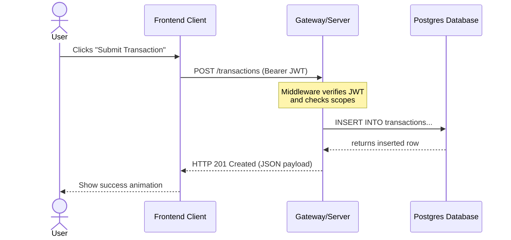

# System Diagrams Directory

Use this directory to store visual representations of system architectures, data flows, and database schemas.

## 🎨 Tooling Guidelines

We recommend using the following tools for diagrams:

1. **Mermaid.js (Recommended)**: Fenced code blocks with `mermaid` tag. These render natively in GitHub and markdown viewers.
2. **Excalidraw**: Save both the raw JSON file (`diagram-name.excalidraw`) and export a static image (`diagram-name.png` or `.svg`) for inclusion in documents.
3. **draw.io / Lucidchart**: Export as `.png` or vector `.svg` files.

---

## 📈 Sample Flow (Mermaid)

