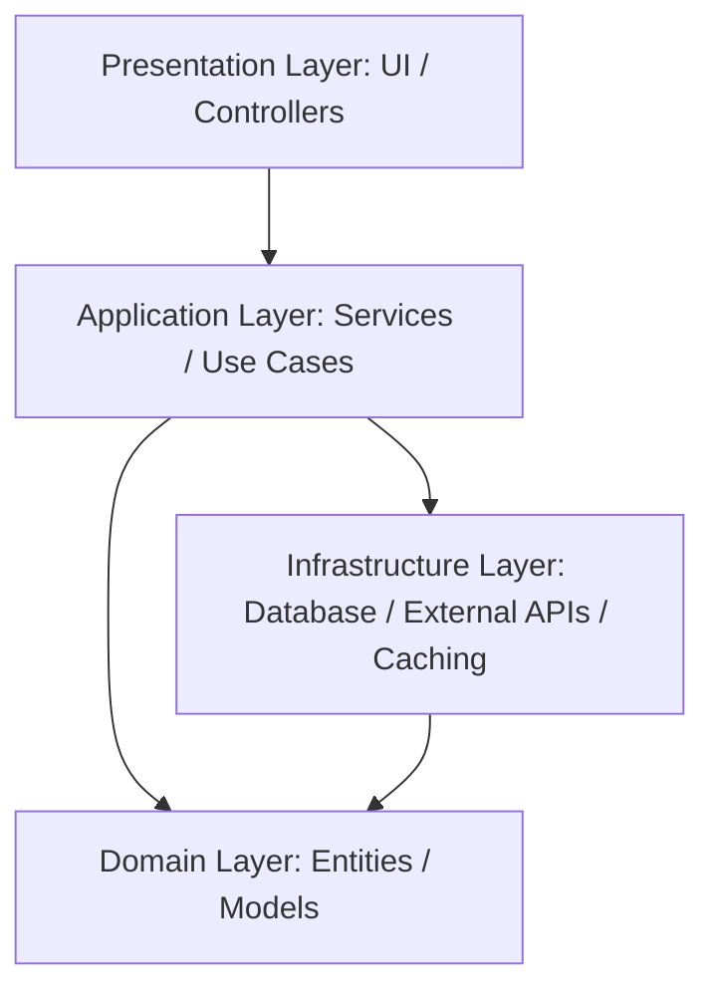

# Architectural Overview

This document describes the high-level architecture guidelines recommended for projects bootstrapped with this template.

---

## 🏛️ Layered Architecture Pattern

Regardless of the selected framework (NestJS, Express, Next.js, or React), we recommend dividing the application code into four distinct layers to separate concerns:

### 1. Presentation Layer (UI / Controllers / CLI)
- **Web/Mobile**: React/React Native components, UI elements, views, and routes.
- **Backend (Express/NestJS)**: HTTP controllers, request validators, and OpenAPI definitions.
- **Responsibility**: Validate input parameters, match routers, render UI components, and delegate execution to the Application Layer.

### 2. Application Layer (Services / Use Cases)
- **Implementation**: Pure business logic (e.g. `registerUser.ts`, `processPayment.ts`).
- **Responsibility**: Orchestrate state modifications, enforce business rules, and trigger infrastructure actions (like sending emails or querying databases) using abstract repository interfaces.

### 3. Domain Layer (Entities / Models)
- **Implementation**: Enterprise-wide business rules, models, constants, and value objects.
- **Responsibility**: Hold core business models without reference to external frameworks (e.g., ORM, Web APIs). This layer should be framework-agnostic.

### 4. Infrastructure Layer (Adapters / Repositories / Data-Access)
- **Implementation**: Database models (Prisma, TypeORM, Mongoose), HTTP clients, file systems adapters, and third-party integrations (Stripe, Twilio, Auth0).
- **Responsibility**: Handle connection protocols, serialize/deserialize data to external endpoints, and execute concrete data transactions.

---

## 🔐 Security & Middleware Guidelines

1. **Authentication & Authorization**: Decouple authentication credentials decoding from controller handlers. Use guards (NestJS), middlewares (Express/Next.js), or custom Hooks (React Native).
2. **Environment Variables Check**: Validate variables on boot-up (e.g. using `zod` or `joi`) to prevent running the system with corrupted environments.
3. **Data Protection**: Ensure secrets (passwords, tokens) are never printed in logs or sent back in JSON payloads.
